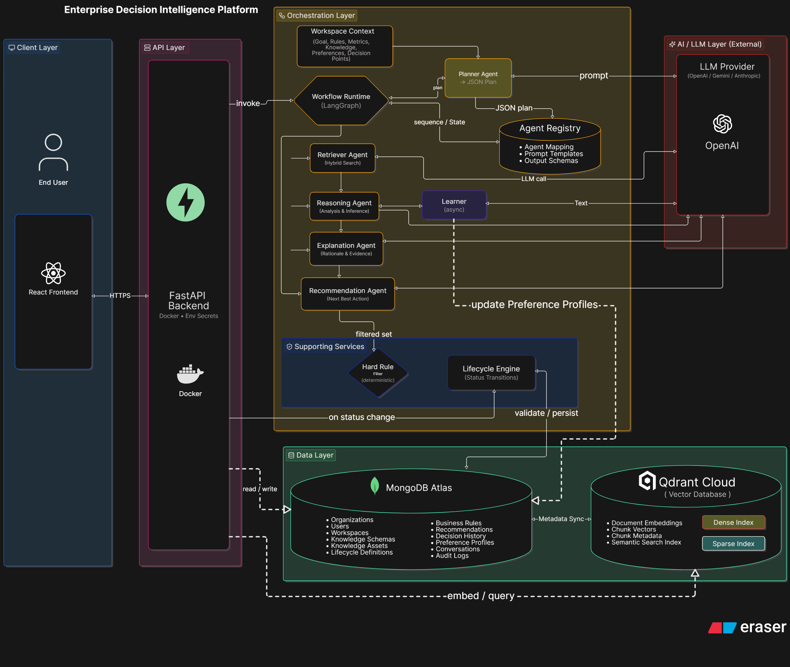

# Enterprise Decision Intelligence Platform

## 1. Project Overview

We built an **Enterprise Decision Intelligence Platform**. This isn't just another RAG chatbot. Our goal was to give companies a safe way to use AI for high-stakes decisions. 

Instead of letting an AI loose on an entire corporate wiki, we force users to create focused "Workspaces." A Workspace acts as a sandbox containing only the specific knowledge needed for that decision. Inside this sandbox, a team of specialized AI agents pulls data, runs logic, and makes a recommendation. Crucially, the AI never has the final say. It surfaces evidence and explains its reasoning, but a human expert always reviews and approves the final outcome. 

---

## 2. High-Level Architecture

Our architecture revolves around strict separation of concerns. We keep the raw infrastructure separated from the orchestration logic, and we keep the orchestration completely separated from the AI prompts. 

Knowledge is stored centrally but accessed locally through isolated Workspaces. This allows our hard-coded business rules and our multi-agent AI workflows to run safely side-by-side without crossing wires.

> *Note: We kept the architecture diagrams as separate high-resolution image files so you can zoom in and actually read them. You'll find them linked and explained below.*

---

## 3. Architecture Diagrams

### Diagram 1 — Enterprise Decision Intelligence Platform Architecture

This diagram shows how we layered the system. The biggest takeaway here is that clients never talk directly to the LLM. Everything routes through a strict API orchestration layer.

We also split our storage. Qdrant holds all the semantic vector data, which is great for similarity search but terrible for exact relationships. MongoDB holds our relational data, business rules, and immutable audit trails. 

By keeping the "Workspace Context" at the center of the architecture, we build a wall around the AI. It can only "see" what's inside the workspace, which practically eliminates cross-domain hallucination. Finally, we didn't use one giant prompt to solve problems. We built a modular pipeline of small, specialized agents. It makes the system way easier to test, debug, and scale.

#### Key Takeaways
* **Strict API Layering:** Clients route through our backend API; they don't hit the LLM directly.
* **Storage Split:** Qdrant handles fuzzy vector searches, while MongoDB handles hard relational data and audit logs.
* **Workspace Isolation:** The AI operates inside a bounded context, drastically reducing hallucinations.
* **Agent Modularity:** We use multiple small agents (Planner, Reasoner, etc.) instead of one massive prompt.

---

### Diagram 2 — Knowledge Ingestion & Indexing Pipeline

Most RAG systems blindly chop up documents and throw them into a vector database. That doesn't work well for complex enterprise data like financial reports or HR policies. 

Instead, we intercept files during upload and run them through an AI analysis step first. We use AI to figure out the document's structure and extract important metadata (like authors, dates, and categories) *before* we chunk it. We only use AI here because hard-coded rules can't reliably parse messy corporate PDFs. 

Once we know what the document is, our configurable schemas dictate exactly how it should be processed. By extracting metadata early, we can run powerful hybrid searches later—combining exact filters (like "Year = 2024") with fuzzy semantic matching.

#### Key Takeaways
* **Smart Preprocessing:** We analyze a document's structure before we chunk it.
* **Schema-Driven Indexing:** Different file types get processed differently based on their schema.
* **Early Metadata Extraction:** We grab metadata upfront to power highly accurate hybrid searches later.
* **Dual Database Setup:** MongoDB tracks the file lineage, while Qdrant handles the actual vector search.

---

### Diagram 3 — Decision Intelligence Execution Pipeline

This is how a decision actually gets made. Notice that it’s a strict workflow, not a chat window. 

Everything starts with the Workspace Context. First, a Planner agent builds a step-by-step execution strategy. This forces the downstream agents to follow a logical path instead of guessing. Before the AI even attempts to reason, we run the data through hard, deterministic business rules. If a candidate fails a rule (e.g., "Budget > $50k"), we drop it immediately. This saves expensive LLM compute and prevents the AI from hallucinating a bad recommendation.

When the AI finally makes a recommendation, we force it to provide a clear explanation and exact source citations. Finally, the system hits a hard stop. A human has to review the evidence, hit approve or reject, and leave feedback. That feedback goes straight into our audit log to help the system learn for next time.

#### Key Takeaways
* **Context-Driven:** Decisions are locked to specific workspaces to prevent data leaks.
* **Dynamic Planning:** The AI writes a plan first, forcing a logical execution path.
* **Rules Before AI:** Fast, hard-coded rules filter out bad options before we pay for LLM tokens.
* **Mandatory Evidence:** Recommendations are invalid without citations and a human-readable explanation.
* **Human-in-the-Loop:** Humans make the final call, and their feedback trains the system.

---

## 4. Key Design Decisions ⭐⭐⭐⭐⭐

> [!NOTE]
> These are the specific choices we made to build a platform that companies would actually trust, rather than just another AI prototype.

### Organization-Centric Knowledge Library
**Problem:** Company knowledge is usually scattered and duplicated across a dozen different tools.
**Our Design Decision:** We built a centralized, multi-tenant Knowledge Library. You upload and process a file exactly once per organization. 
**Why it matters:** It creates a single source of truth, saves storage space, and ensures the AI is always pulling from the most up-to-date version of a document.

### Workspace as a Decision Context
**Problem:** Asking an AI a question against an entire company's database usually results in messy, hallucinated answers.
**Our Design Decision:** We built isolated Workspaces. Users explicitly attach only the exact files needed for a specific decision.
**Why it matters:** It artificially limits what the AI can read. Less noise means better accuracy and fewer hallucinations.

### Knowledge Attachment Instead of Duplication
**Problem:** Copying files into different projects means things get out of sync fast.
**Our Design Decision:** Workspaces don't store files. They just hold reference pointers to the master files in the Knowledge Library.
**Why it matters:** If HR updates a master policy, every active workspace relying on that policy gets the update instantly. 

### AI-Assisted Knowledge Processing
**Problem:** If you chunk a complex PDF blindly, your search results will be garbage.
**Our Design Decision:** We run an AI pass on files during upload to detect tables, lists, and metadata before we start chunking.
**Why it matters:** It lets us pick the right chunking strategy dynamically, so we don't accidentally split a single paragraph across two different vectors.

### Schema-Driven Processing
**Problem:** A resume needs to be parsed very differently than a 100-page technical manual.
**Our Design Decision:** We use Knowledge Schemas—configurable templates that tell the system exactly how to read and map specific types of documents.
**Why it matters:** It gives the LLM a predictable, structured graph of data to reason over instead of a massive wall of unstructured text.

### Human-in-the-Loop Decisions
**Problem:** Letting AI make final business decisions is too risky.
**Our Design Decision:** The AI orchestrator never pulls the trigger. It ranks options, explains itself, and pauses execution to wait for a human.
**Why it matters:** It keeps companies compliant and accountable. The AI acts as an incredibly fast research assistant, not a replacement for a manager.

### Explainable AI with Evidence
**Problem:** Executives won't trust an AI if they can't see how it got to its answer.
**Our Design Decision:** Every recommendation comes bundled with a plain-English explanation and direct citations to the source files.
**Why it matters:** A human reviewer can instantly click through to see the exact document the AI read, building immediate trust.

### AI as Fallback (Rules → AI)
**Problem:** Using LLMs to check simple math or binary logic is slow, expensive, and sometimes wrong.
**Our Design Decision:** We run cheap, deterministic Business Rules first. We filter out the obvious failures instantly, and only pass the survivors to the LLM for deep reasoning.
**Why it matters:** We save money on tokens, speed up the workflow, and guarantee the AI doesn't hallucinate past hard constraints.

### Modular Agent Architecture
**Problem:** Trying to cram everything into one giant LLM prompt makes the system brittle and impossible to debug.
**Our Design Decision:** We built a multi-agent system using LangGraph. We have separate agents for planning, retrieving, reasoning, and explaining.
**Why it matters:** If the retriever agent is struggling, we can fix it without breaking the reasoning agent. It makes the platform actually scalable.

---

## 5. Technology Stack

| Component | Technology |
| :--- | :--- |
| **Backend Framework** | FastAPI (Python) |
| **Database (Relational/Doc)** | MongoDB |
| **Vector Database** | Qdrant |
| **AI Orchestration** | LangGraph / LangChain |
| **LLM Provider** | OpenAI (GPT-4o) |
| **Embeddings** | OpenAI (text-embedding-3-small) |
| **Search Paradigm** | Hybrid Retrieval (Dense + Sparse) |
| **Frontend Framework** | React (Vite) |
| **Styling** | Vanilla CSS (Custom Design System) |
| **Containerization** | Docker |
| **Observability** | Prometheus + Structured Logging |
